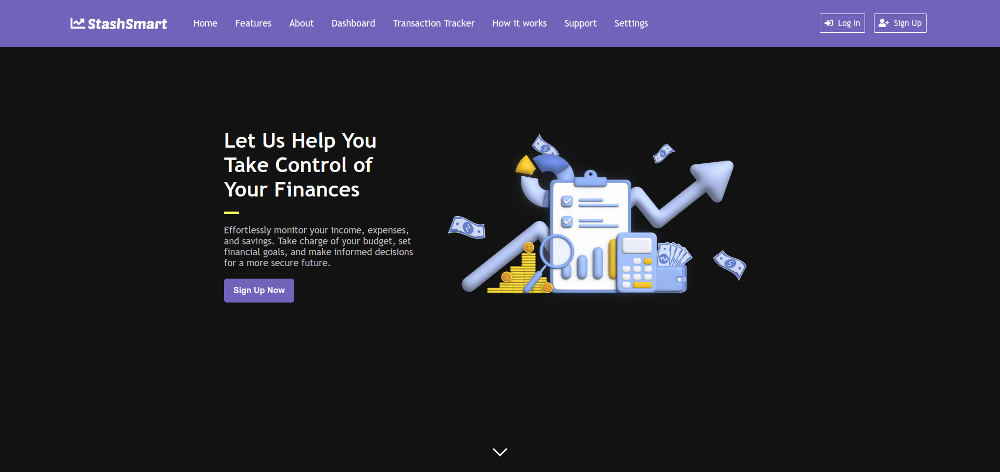
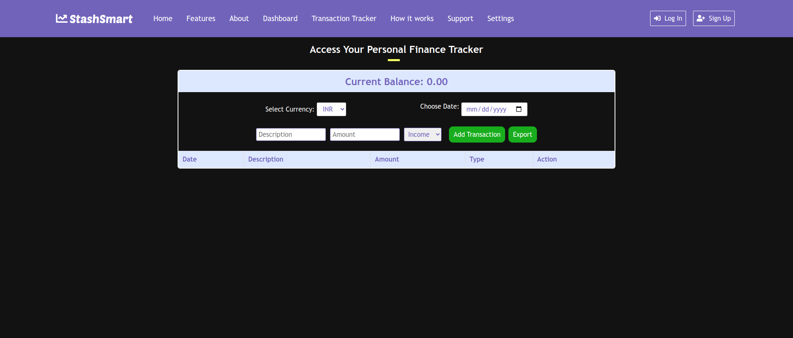

# StashSmart - Personal Finance Tracker

StashSmart is a web-based personal finance tracker designed to empower users with control over their financial well-being.  It provides a user-friendly interface for effortless management of income, expenses, and savings. This empowers users to set financial goals, categorize transactions, and gain valuable insights into their spending habits through detailed reports and analytics. 

## Features:

* Login Page: Allows users to access their accounts.
* Signup Page: Enables new users to create accounts.
* Home Page: Displays a personalized overview of financial information.
* Dashboard Page: The central hub for viewing all financial information at a glance.
* Transaction Tracker Page: Allows users to enter income and expense transactions efficiently.
* How It Works Page: Provides a clear and concise explanation of the app's features and functionalities.
* Customizable currency settings:  Users set their preferred display currency (e.g., USD, EUR, GHS).
* Support Page: Offers resources and assistance to users for any queries or issues they may encounter.
* Settings Page: Enables users to manage preferences such as notifications, account linking, and other custom settings.

## Technologies Used

- HTML
- CSS
- JavaScript

## Contributing

Contributions are welcome! If you have any suggestions, bug reports, or feature requests, please open an issue or submit a pull request.

## Acknowledgements

- [Feather Icons](https://feathericons.com/) - Icons used in the application
- [Font Awesome](https://fontawesome.com/) - Icons used in the application

## Contact

For any inquiries or questions, please contact [email protected]

Enjoy managing your finances with Personal Finance Tracker!
